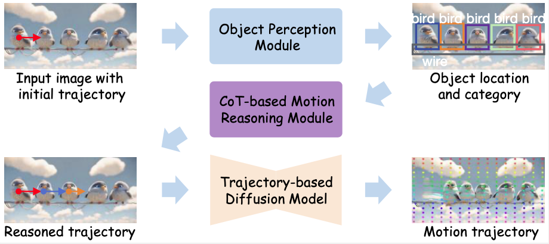
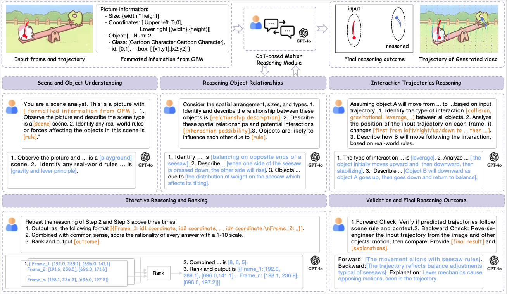
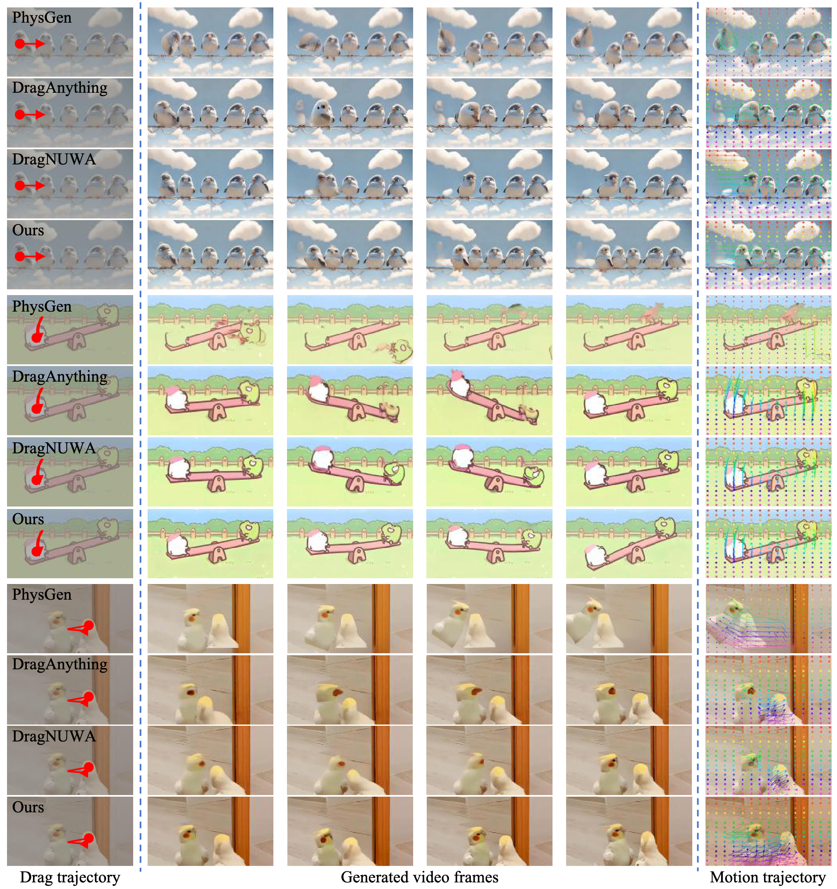
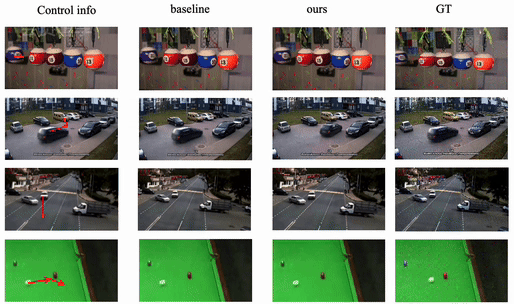
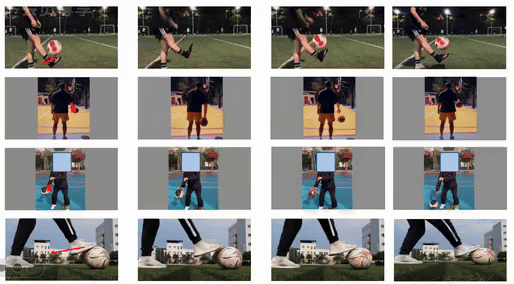
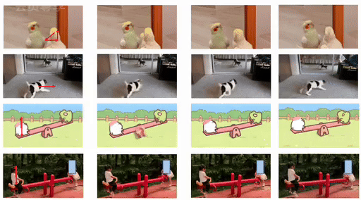

# C-Drag-Official-Repo
### **C-Drag: Chain-of-Thought Driven Motion Controller for Video Generation**

<p align="center">
    
</p>

#### [Yuhao Li](), [Mirana Claire Angel](https://www.researchgate.net/profile/Mirana-Angel), [Salman Khan](https://salman-h-khan.github.io/), [Yu Zhu](), [Jinqiu Sun](https://teacher.nwpu.edu.cn/m/2009010133), [Yanning Zhang](https://jszy.nwpu.edu.cn/1999000059) and [Fahad Khan](https://sites.google.com/view/fahadkhans/home)

#### **Northwestern Polytechnical University， Mohamed bin Zayed University of AI, Australian National University, Linköping University**

<!-- [](site_url) -->
[](https://arxiv.org/abs/2406.04844.pdf)

## Latest 
- `2025/02/14`: We released our code and benchmark.
- `2025/02/13`: We released our technical report on [arxiv](https://arxiv.org/abs/2406.04844.pdf). Our code and models are coming soon!

<br>
<details>
  <summary>
  <font size="+1">Abstract</font>
  </summary>
Trajectory-based motion control has emerged as an intuitive and efficient approach for controllable video generation. However, the existing trajectory-based approaches are usually limited to only generating the motion trajectory of the controlled object and ignoring the dynamic interactions between the controlled object and its surroundings. To address this limitation, we propose a Chain-of-Thought-based motion controller for controllable video generation, named C-Drag. Instead of directly generating the motion of some objects, 
our C-Drag first performs object perception and then reasons the dynamic interactions between different objects according to the given motion control of the objects. Specifically, our method includes an object perception module and a Chain-of-Thought-based motion reasoning module. The object perception module employs visual language models to capture the position and category information of various objects within the image. The Chain-of-Thought-based motion reasoning module takes this information as input and conducts a stage-wise reasoning process to generate motion trajectories for each of the affected objects, which are subsequently fed to the diffusion model for video synthesis.  
Furthermore, we introduce a new video object interaction (VOI) dataset to evaluate the generation quality of motion controlled video generation methods. Our VOI dataset contains three typical types of interactions and provides the motion trajectories of objects that can be used for accurate performance evaluation.  Experimental results show that C-Drag achieves promising performance across multiple metrics, excelling in object motion control. 
Our benchmark, codes, and models will be publicly released. 
</details>

## Intro


- **C-Drag** first takes a single RGB image and one or more drag motion trajectories as input. We employ an object perception module to obtain information about all related objects in the image. Chain-of-Thought (CoT)-based reasoning module introduces a reasoning strategy to precisely reason motion trajectories of all objects according to the detected position and category information. With the generated object trajectories, we use a pre-trained trajectory-based generation model to generate the videos with multiple-object interactions. 

<div align=center>
	
</div>

- **CoT-based Motion Reasoning Module**  An illustrative view of CoT-based Motion Reasoning Module which undergoes a five-stage reasoning process. **Scene  and Object Understanding**, where a pre-trained visual language model (VLM) interprets the scene and establishes motion rules using formated information from Object Perspection Module. In **Reasoning Object Relationship**, the VLM identifies spatial relationships and potential interactions among objects to inform trajectory predictions. **Interaction Trajectories Reasoning** follows, categorizing interactions (e.g., collisions, forces) and predicting affected object paths. During **Iterative Reasoning and Ranking**, initial predictions are iteratively optimized, with the VLM selecting the most consistent motion sequences. Finally, in **Validation and Final Reasoning Outcome**, forward and backward validation ensures predicted trajectories align with scene rules, iterating until accuracy is achieved.

<div align=center>
	
</div>
<!--  -->

- We propose a new [VOI dataset](). This dataset has 72 videos and contains three typical types of object interactions, including *collision and chain reaction*, *gravity and force*, and *levers and mirrors*. We counted the number of videos, annotated boxes, and the objects trajectories.

| Category | Sub-category | Video | Anno Boxes | Anno Trajectories |
| :---: | :---: | :---: | :---: | :---: |
| Collision and Chain Reaction <br> | Billiard  <br> NewtonCradle <br> Traffic| 16 <br> 7 <br> 10| 2160 <br> 300 <br> 180 | 198 <br> 79 <br> 90|
| Gravity and Force | Basketball <br> FootBall| 6 <br> 7 | 1080 <br> 960 | 34 <br> 76 | 
| Levers and Mirrors | Seesaw <br> Mirror| 15 <br> 11| 840 <br> 1800 | 145 <br> 89 |
| Total | - | 72 | 7320 | 711 |


## Visualization
<!-- <div align=center>

</div> -->

<div style="display:flex; flex-direction:column; justify-content:center;">
    
    
    
</div>

## Getting Start

### Setting Environment 
```Shell
git clone https://github.com/WesLee88524/C-Drag-Official-Repo.git
cd C-Drag-Official-Repo

conda create -n C-Drag python=3.8
conda activate C-Drag
pip install -r environment.txt
```

### Download Pretrained Weights
Download the [Pretrained Weights](https://drive.google.com/file/d/1Z4JOley0SJCb35kFF4PCc6N6P1ftfX4i/view) to `models/` directory or directly run `bash models/Download.sh`.

### Drag and Animate!
```Shell
python demo.py
```
It will launch a gradio demo, and you can drag an image and animate it!


## Citation
if you use our work, please consider citing us:
```BibTeX
@misc{li2025cdrag,
      title={C-Drag: Chain-of-Thought Driven Motion Controller for Video Generation}, 
      author={Yuhao Li and Mirana Claire Angel and Salman Khan and Yu Zhu and Jinqiu Sun and Yanning Zhang and Fahad Shahbaz Khan},
      year={2025},
      eprint={2502.04844},
      archivePrefix={arXiv},
      primaryClass={cs.CV}
}


```


## License
This project is released under the Apache license. See [LICENSE](LICENSE) for additional details.

## Acknowledgement
We appreciate the open source of the following projects:
[DragNUWA](https://github.com/camenduru/DragNUWA), [DragAnything](https://github.com/showlab/DragAnything);

